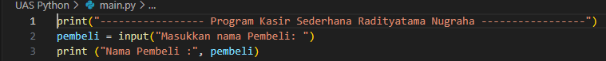

# UAS-Kasir-Python

# - MENAMPILKAN INPUT PROGRAM NYA

## 1. Mula-mula kita diminta menginputkan nama pembeli, kemudian nama dimasukkan ke variabel "pembeli"

## 2. Selanjutnya memanggil fungsi "fungsimakanan()", yang didalamnya menampilkan menu makanan 1/2/3/4/5, kita diminta memilih dengan memasukkan angka 1/2/3/4/5, jika memilih selain angka tersebut pertanyaan menu akan diulang dengan pemanggilan ulang fungsi "fungsimakanan()" pada kondisi else

## 3. Memasukkan jumlah "porsi".

## 4. Mendapatkan total harga makanan dengan cara "porsi*harga" makanan terkait, dimasukkan ke dalam variabel "totalmkn". Dan "mkn" menampung nama makanan sesuai menu yang dipilih

## 5. Selanjutnya memanggil fungsi "fungsiminuman()", yang didalamnya menampilkan menu minuman 1-3, kita diminta memilih dengan memasukkanangka 1/2/3, jika memilih selain angka tersebut pertanyaan menu akan diulang dengan pemanggilan ulang fungsi "fungsiminuman()" pada kondisi else

## 6. Memasukkan "gelas".

## 7. Mendapatkan total harga minuman dengan cara "gelas*harga" minuman terkait, dimasukkan ke dalam variabel "totalmnm". Dan "mnm" menampung nama minuman sesuai menu yang dipilih

## 8. Menampilkan total yang harus dibayar dengan cara menambah "totalmkn+totalmnm" dimasukkan ke dalam variabel "totalsemua"

## 9. Menginputkan uang yang diberikan pembeli dimasukkan ke dalam variabel "uang"

## 10. Menampilkan kembalian dengan cara "uang-totalsemua"

## 11. Terakhir mencetak STRUK dengan data dari proses-proses yang sudah terjadi

## 12. MENAMPILKAN OUTPUT PROGRAM NYA

